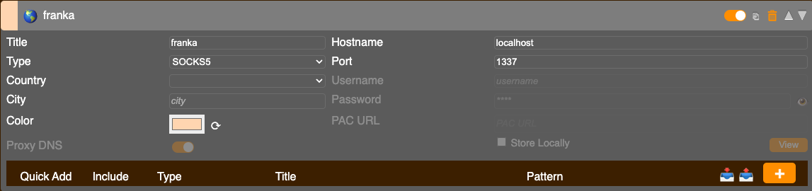
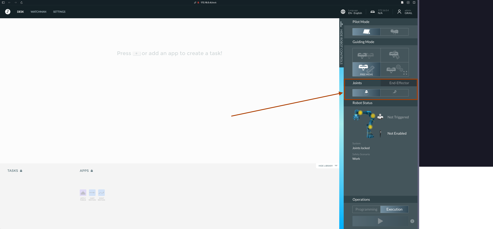
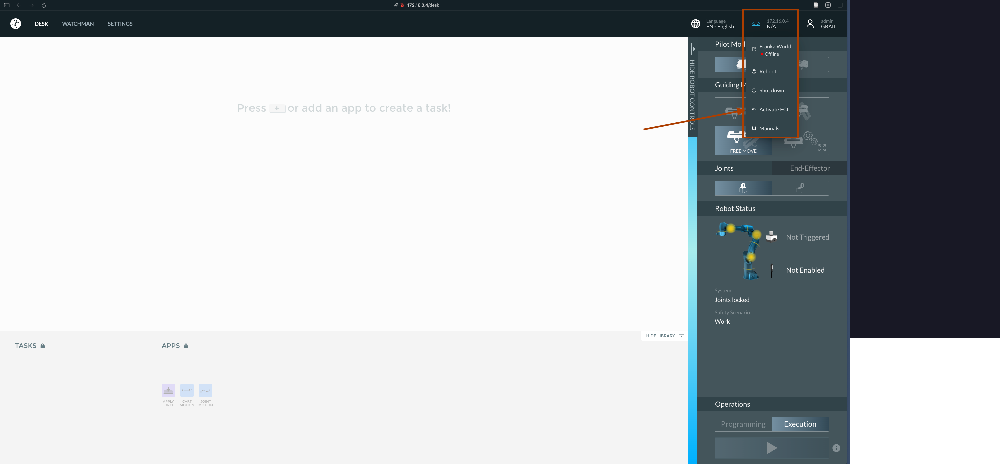

# Franka-Teach

Bi-Manual Franka 3 robot setup.


## NUC Setup

1. Install Ubuntu 22.04 and a real-time kernel
2. Make sure the NUC is booted with the real-time kernel [[link](https://frankaemika.github.io/docs/installation_linux.html#setting-up-the-real-time-kernel)].


## Lambda Machine Setup

todo: how to setup network, etc.


1. Setup deoxys_control. NOTE: When doing `./InstallPackage`, select `0.13.3` for installing libfranka:

```bash
git clone git@github.com:NYU-robot-learning/deoxys_control.git
mamba create -n "franka_teach" python=3.10
conda activate franka_teach
cd deoxys_control/deoxys

# Instructions from deoxys repo (this takes a while to build everything)
./InstallPackage
make -j build_deoxys=1
pip install -U -r requirements.txt
```

2. Install the Franka-Teach requirements:

```bash
cd /path/to/Franka-Teach
pip install -r requirements.txt
```

3. Install ReSkin sensor library:

```bash
git clone git@github.com:NYU-robot-learning/reskin_sensor.git
cd reskin_sensor
pip install -e .
```


## Proxy Setup

1. Install FoxyProxy extension on Chrome or Firefox. Set up the proxy like this:



2. Setup NUC as an ssh host like this:

```bash
Host nuc
    HostName 10.19.248.70
    User robot-lab
    LogLevel ERROR
    DynamicForward 1337
```


## How to run the Franka-Teach environment

1. Ssh into the nuc:

```bash
ssh nuc
```

2. Go to `172.16.0.4/desk` for the Franka Desk interface for the right robot and `172.16.1.4/desk` for the left robot.

The following credentials are used for the Franka Desk interface:

```
Username: GRAIL
Password: grail1234
```

NOTE: Franka Desk is cursed. You might face all sorts of issues with it. General troubleshooting:

- If it doesn't seem to connect, keep refreshing. If you lose all hope, reboot the robot.
- If end-effector doesn't show as active, you can go to the settings page and do a power off/on for the end-effector. You need to re-initialize the gripper in the same page after doing a power cycle.
- Two desk pages (for two robots) cannot be open at the same time. Close one tab and connect to the other one.

3. Open the brakes for the robot:



4. Enable FCI mode:



5. Start the deoxys control process on the NUC:

```bash
cd /home/robot-lab/work/deoxys_control/deoxys
./auto_scripts/auto_arm.sh config/franka_left.yml # franka_right.yml for the right robot
./auto_scripts/auto_gripper.sh config/franka_left.yml # in a different terminal, if you want to use the gripper
```

6. From the Lambda, start servers:

```bash
cd /path/to/Franka-Teach/
python3 franka_server.py
python3 camera_server.py # in a different terminal
```

7. TODO: run franka_env test script:

```bash
cd /path/to/Franka-Teach/
python3 test_franka_env.py
```

## How to teleoperate

1. Do the steps until 6 in the "How to run the Franka-Teach environment" section.


2. Also, start the teleoperation script. Set the teleop mode based on if you are collecting human or robot demonstrations.:

```bash
python3 teleop.py teleop_mode=<human/robot>
```

3. You can start the data collection by running the `collect_data.py` script. Set the `demo_num` to the number of demonstrations you want to collect and `collect_depth` to `True` if you want to collect depth data from the Intel realsense cameras.

```bash
python3 collect_data.py demo_num=0 collect_depth=<True/False>
```

4. For robot teleoperation, use the VR controllers to control the robot. When collecting human data, use the VR controller to start and stop the data collection while performing the actions with the human hand.
